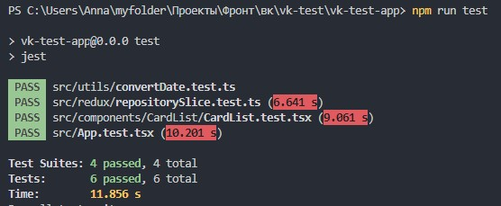

# Тестовое задание для VK
* Результат опубликован по ссылке: https://gudzan.github.io/vk-test/
* Стек: TS, Redux, CSS-модули, Vite, Jest, React Testing Library;
* Для получения списка используется публичный github api
* Для работы с апи используется axios
* Есть возможность редактировать и удалять элементы из списка локально (Redux)
* Присутствует сортировка списка по разным полям
* Есть индикация подгрузки данных
* Использовуется Material UI. Выбрала его, потому что:
  * Material UI специально разработан для React, это обеспечивает легкую интеграцию. 
  * Material UI имеет легко узнаваемый интерфейс
  * Material UI хорошо документирован и интуитивно понятен для новичков
  * Material UI очень просто использовать, поскольку есть много готовых компонентов
* Функциональность покрыла несколькими unit-тестами на Jest + React Testing Library. Сделала тесты на:
  * Пара тестов для ts функции convertDate
  * Тестирование двух action для redux
  * Тесты для проверки отображения элементов на экране (CardList, Header, main)

Что есть в проекте:
* Бесконечный скрол карточек с репозиториями
* При загрузке данных отображается спиннер
* В карточке есть аватарка создателя, имя создателя и время создания репозитория. А также название, описание, форки, звездочки, подписчики и прямая ссылка на репозиторий
* Сортировка по имени, форкам и звездам в разных направлениях (asc, desc)
* Можно локально удалить карточку
* Можно локально отредактировать карточку (не пугайся, если карточка убежит. Сразу после удаления обновится сортировка и карточка может подняться выше или ниже, если того требует сортировка)
* Сайт адаптирован под мобильные устройства
